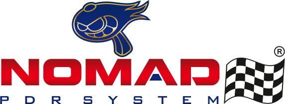

<div align="center">



# Nomad PDR System

[](LICENCE.md)


[](https://www.typescriptlang.org/)
[](https://nextjs.org/)
[](https://tailwindcss.com/)
[](https://vercel.com/)

[Portuguese](README.pt.md) | English

</div>

## About

Institutional landing page for **Nomad PDR System** — specialists in Paintless Dent Repair (PDR) and hail damage recovery. Built with Next.js 16 App Router, bilingual (EN/PT), with an integrated contact form and email notifications via Resend.

Available at **[nomadpdr.pt](https://www.nomadpdr.pt/)**.

## Requirements

| Tool | Version |
| ---- | ------- |
| Node.js | 20+ |
| npm / pnpm | any |

## How to run

```bash
cp .env.example .env.local   # fill in RESEND_API_KEY and remaining vars
npm install
npm run dev                  # http://localhost:3000
npm run build && npm start   # production build
```

## License

Distributed under the **CC BY-NC 4.0** license, © 2025 Nycolas Souza.

Non-commercial use only. You may share and adapt the material as long as you give appropriate credit and do not use it for commercial purposes.

The full text is in [LICENCE.md](LICENCE.md).
